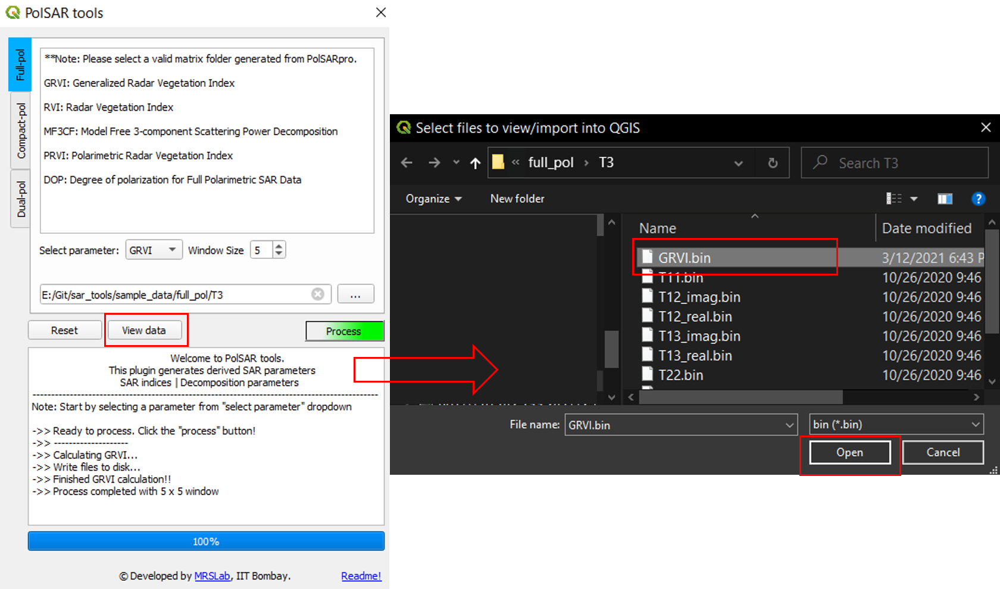

<p align="center">
  
</p>

### A python based [QGIS](https://qgis.org/en/site/index.html) plugin 
[](https://joss.theoj.org/papers/aba2f441ab3c99e7694c97345e1255a0)
[](https://sar-tools.readthedocs.io/en/latest/?badge=latest)
[](https://opensource.org/licenses/gpl-license)
[](https://github.com/ellerbrock/open-source-badges/)
[](https://zenodo.org/badge/latestdoi/238603440)
[](https://www.python.org/)
[](https://github.com/Narayana-Rao/PolSAR-tools/releases)
[](https://GitHub.com/Narayana-Rao/PolSAR-tools/commit/)
[](https://GitHub.com/Narayana-Rao/PolSAR-tools/graphs/commit-activity)
[](http://www.mrslab.in/qgisplugin/)
<p align="center">
<a href="https://hits.seeyoufarm.com"></a>
</p>

> **Cite:** Bhogapurapu, N., Dey, S., Mandal, D., Bhattacharya, A. and Rao, Y.S., 2021. PolSAR tools: A QGIS plugin for generating SAR descriptors. Journal of Open Source Software, 6(60), p.2970. doi:  [10.21105/joss.02970](https://doi.org/10.21105/joss.02970)  


## General Information
-------------------
This plugin generates derived SAR parameters (viz. vegetation indices, polarimetric decomposition parameters) from input polarimetric matrix (C3, T3, C2, T2). The input data needs to be in [PolSARpro](https://earth.esa.int/web/polsarpro/home)/[ENVI](https://www.l3harrisgeospatial.com/Software-Technology/ENVI) format (\*.bin and \*.hdr). It requires [numpy](https://numpy.org/), [matplotlib](https://matplotlib.org/) python libraries pre-installed.

## Installation

> **__Note:__** PolSAR tools requires QGIS version >=3.0.

* The easiest way (requires internet connection) : 
    - Open QGIS -> Plugins -> Manage and Install Plugins... -> select ```All``` tab -> search for ```PolSAR tools``` --> select and install plugin
* Alternative way (offline installation) : 
    - Go to [releases](https://github.com/Narayana-Rao/SAR-tools/releases) of this repository -> select desired version -> download the ```.zip``` file.
    - Open QGIS -> Plugins -> Manage and Install Plugins... -> ```install from ZIP``` tab --> select the downloaded zip --> install plugin (ignore warnings, if any).
 
## Up and running

After successful installation, find the plugin by opening **QGIS** --> Plugins --> ``PolSAR tools`` --> Process. As shown in the following figure.

<p align="center">
  
  <p align="center"> <em>Opening the plugin</em> </p>
</p>

<p align="center">
  
  <p align="center"> <em>GUI-Main window layout</em> </p>
</p>


**Layout**:

1.  Data type tabs: Functions are arranged according to the data type (full-, compact- and dual-pol).
2.  Function details viewer: Contains a list of functions for respective data tab. 
3. Derived parameter selection, required input variables and constraints.
4. Input data folder
5. Logger: displays the log of processing parameters
6. progressbar: shows the progress of the current task.
7. Credits and quick help.


Additional ``reset`` button to clear the environment, ``view data`` button to import the data into **QGIS** environment and ``Process`` button to start processing after selecting valid input data variables. 


## Available functionalities:
-----------------------------
  * Full-pol :
    * Model free 4-Component decomposition for full-pol data (MF4CF)[[11]](#11)
    * Model free 3-Component decomposition for full-pol data (MF3CF)[[4]](#4)
	* Radar Vegetation Index (RVI) [[8]](#8) 
    * Generalized volume Radar Vegetation Index (GRVI) [[2]](#2)
    * Polarimetric Radar Vegetation Index (PRVI) [[1]](#1)
    * Degree of Polarization (DOP) [[10]](#10) 

  * Compact-pol : 
    * Model free 3-Component decomposition for compact-pol data (MF3CC) [[4]](#4)
    * Improved S-Omega decomposition for compact-pol data (iS-Omega) [[7]](#7)
    * Compact-pol Radar Vegetation Index (CpRVI)  [[6]](#6)
    * Degree of Polarization (DOP)  [[10]](#10) 

  * Dual-pol:
	* Dual-pol Radar Vegetation Index (DpRVI) [[5]](#5)
	* Radar Vegetation Index (RVI) [[9]](#9)
    * Degree of Polarization (DOP) [[10]](#10) 
    * Polarimetric Radar Vegetation Index (PRVI) [[1]](#1)

## Example usage
> Note: All the following processing steps should be done in sequential manner. Sample data for all the polarization modes is provided in [sample_data](/sample_data/) folder.


**STEP 1**: Open the plugin as explained in [Up and Running section](#Up-and-running).

**STEP 2**: Select the polarimetric data type (Full/compact/dual).

<p align="center">
  
  <p align="center"> <em>Selecting the polarimetric mode</em> </p>
</p>

**STEP 3**: Select the parameter/descriptor from the dropdown menu.

<p align="center">
  
  <p align="center"> <em>Selecting the polarimetric descriptor</em> </p>
</p>

**STEP 4**: Provide the required input variables.
<p align="center">
  
  <p align="center"> <em>Selecting the input variables</em> </p>
</p>

**STEP 5**: Select the input matrix folder.

<p align="center">
  
  <p align="center"> <em>Selecting the input folder</em> </p>
</p>

**STEP 6**: Wait for the logger to prompt ```->> Ready to process.``` --> click process
> **__Note:__** Do not click process button more than once while it is processing. It may crash the QGIS and the plugin.
It is possible that the plugin may show not responding for larger datasets but please wait for the process to complete.

<p align="center">
  
  <p align="center"> <em>Processing the data for selected descriptor</em> </p>
</p>

**STEP 7** (optional): Click view data to import the data into QGIS for vizualisation of the generated descriptors.

<p align="center">
  
  <p align="center"> <em>Importing the data into QGIS for visualization</em> </p>
</p>
<p align="center">
  
  <p align="center"> <em>Imported data in QGIS</em> </p>
</p>

## Functions description

Description and the details of all the core functions of this plugin are available here: [Functions_description](help/Functions_description.md)


```bibtex
@article{bhogapurapu2021polsar,
  title={PolSAR tools: A QGIS plugin for generating SAR descriptors},
  author={Bhogapurapu, Narayanarao and Dey, Subhadip and Mandal, Dipankar and Bhattacharya, Avik and Rao, YS},
  journal={Journal of Open Source Software},
  volume={6},
  number={60},
  pages={2970},
  year={2021},
  doi= {10.21105/joss.02970}
}

```

## Contributions
1) Contribute to the software

    [Contribution guidelines for this project](help/CONTRIBUTING.md)


2) Report issues or problems with the software
	
	Please raise your issues here : <https://github.com/Narayana-Rao/SAR-tools/issues>

3) Seek support

	Please write to us: <bnarayanarao@iitb.ac.in> 

## References
-------------
<a id="1">[1]</a> 
Chang, J.G., Shoshany, M. and Oh, Y., 2018. Polarimetric Radar Vegetation Index for Biomass Estimation in Desert Fringe Ecosystems. IEEE Transactions on Geoscience and Remote Sensing, 56(12), pp.7102-7108.

<a id="2">[2]</a> 
Ratha, D., Mandal, D., Kumar, V., McNairn, H., Bhattacharya, A. and Frery, A.C., 2019. A generalized volume scattering model-based vegetation index from polarimetric SAR data. IEEE Geoscience and Remote Sensing Letters, 16(11), pp.1791-1795.

<a id="3">[3]</a> 
Mandal, D., Kumar, V., Ratha, D., J. M. Lopez-Sanchez, A. Bhattacharya, H. McNairn, Y. S. Rao, and K. V. Ramana, 2020. Assessment of rice growth conditions in a semi-arid region of India using the Generalized Radar Vegetation Index derived from RADARSAT-2 polarimetric SAR data, Remote Sensing of Environment, 237: 111561.

<a id="4">[4]</a> 
Dey, S., Bhattacharya, A., Ratha, D., Mandal, D. and Frery, A.C., 2020. Target Characterization and Scattering Power Decomposition for Full and Compact Polarimetric SAR Data. IEEE Transactions on Geoscience and Remote Sensing.

<a id="5">[5]</a> 
Mandal, D., Kumar, V., Ratha, D., Dey, S., Bhattacharya, A., Lopez-Sanchez, J.M., McNairn, H. and Rao, Y.S., 2020. Dual polarimetric radar vegetation index for crop growth monitoring using sentinel-1 SAR data. Remote Sensing of Environment, 247, p.111954.

<a id="6">[6]</a> 
Mandal, D., Ratha, D., Bhattacharya, A., Kumar, V., McNairn, H., Rao, Y.S. and Frery, A.C., 2020. A Radar Vegetation Index for Crop Monitoring Using Compact Polarimetric SAR Data. IEEE Transactions on Geoscience and Remote Sensing, 58 (9), pp. 6321-6335.

<a id="7">[7]</a> 
V. Kumar, D. Mandal, A. Bhattacharya, and Y. S. Rao, 2020. Crop Characterization Using an Improved Scattering Power Decomposition Technique for Compact Polarimetric SAR Data. International Journal of Applied Earth Observations and Geoinformation, 88: 102052.

<a id="8">[8]</a> 
Kim, Y. and van Zyl, J.J., 2009. A time-series approach to estimate soil moisture using polarimetric radar data. IEEE Transactions on Geoscience and Remote Sensing, 47(8), pp.2519-2527.

<a id="9">[9]</a> 
Trudel, M., Charbonneau, F. and Leconte, R., 2012. Using RADARSAT-2 polarimetric and ENVISAT-ASAR dual-polarization data for estimating soil moisture over agricultural fields. Canadian Journal of Remote Sensing, 38(4), pp.514-527.

<a id="10">[10]</a> 
Barakat, R., 1977. Degree of polarization and the principal idempotents of the coherency matrix. Optics Communications, 23(2), pp.147-150.

<a id="11">[11]</a> S. Dey, A. Bhattacharya, A. C. Frery, C. Lopez-Martinez and Y. S. Rao, "A Model-free Four Component Scattering Power Decomposition for Polarimetric SAR Data," in IEEE Journal of Selected Topics in Applied Earth Observations and Remote Sensing, 2021. doi: [10.1109/JSTARS.2021.3069299](https://doi.org/10.1109/JSTARS.2021.3069299). 
