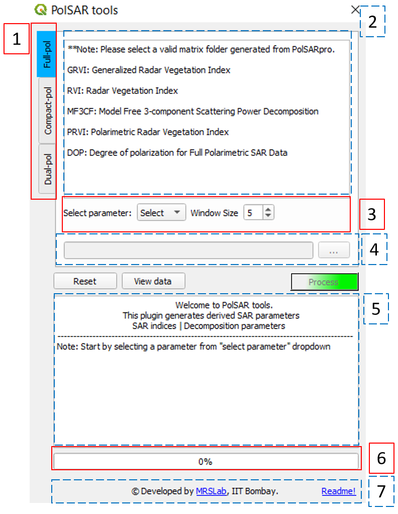

General Information
===================

This plugin generates derived SAR parameters (viz. vegetation indices, polarimetric decomposition parameters) from input polarimetric matrix (C3, T3, C2, T2). The input data needs to be in `PolSARpro`_/`ENVI`_ format (\*.bin and \*.hdr). It requires `numpy`_, `matplotlib`_ python libraries pre-installed.

Installation
-------------------

.. note::

    SAR tools requires QGIS version >=3.0.

* The easiest way (requires internet connection) : 
	- Open QGIS -> Plugins -> Manage and Install Plugins... --> select ``All`` tab -> search for ``SAR tools`` --> select and install plugin
* Alternative way (offline installation) : 
	- Go to `releases`_ of SAR tools -> select desired version -> download the ``.zip`` file.
	- Open QGIS -> Plugins -> Manage and Install Plugins... --> ``install from ZIP`` tab --> select the downloaded zip --> install plugin (ignore warnings, if any).

Up and running
--------------

After successful installation, find the plugin by opening **QGIS** --> Plugins --> ``SAR tools`` --> Process. As shown in the following figure.

.. figure:: figures/open_ui.png
    :scale: 80%
    :align: center
    
    Opening the plugin 

    
    GUI-Main window layout

**Layout**:

1.  Data type tabs: Functions are arranged according to the data dype (full-, compact- and dual-pol).
2.  Function detials viewer: Contains list of functions for respective data tab. 
3. Derived arameter selection, required input variables and constraints.
4. Input data folder
5. Logger: displays the log of procesing parameters
6. progressbar: displays the progress of current task.
7. Credits and quick help.

Additional ``reset`` button to clear the envirinment, ``view data`` button to import the data into **QGIS** environment and ``Process`` button to start processing after selecting valid input data variables. 

 

Available functionalities
--------------------------

  * Indices :
  	* Radar Vegetation Index (RVI) (Full-pol and dual-pol)
  	* Generalized volume Radar Vegetation Index (GRVI) 
  	* Polarimetric Radar Vegetation Index (PRVI) (Full-pol and dual-pol) 
  	* Dual-pol Radar Vegetation Index (DpRVI)
  	* Degree of Polarization (DOP) (Full-pol, dual-pol, and compact-pol)
  	* Compact-pol Radar Vegetation Index (CpRVI)
  
  * Polarimetric Decompositions : 
  	* Model free 3-Component decomposition for full-pol data (MF3CF).
  	* Model free 3-Component decomposition for compact-pol data (MF3CC) 
  	* Improved S-Omega decomposition for compact-pol data (iS-Omega

.. _PolSARpro: https://earth.esa.int/web/polsarpro/home
.. _ENVI: https://www.l3harrisgeospatial.com/Software-Technology/ENVI
.. _numpy: https://numpy.org/
.. _matplotlib: https://matplotlib.org/
.. _releases: https://github.com/Narayana-Rao/SAR-tools/releases